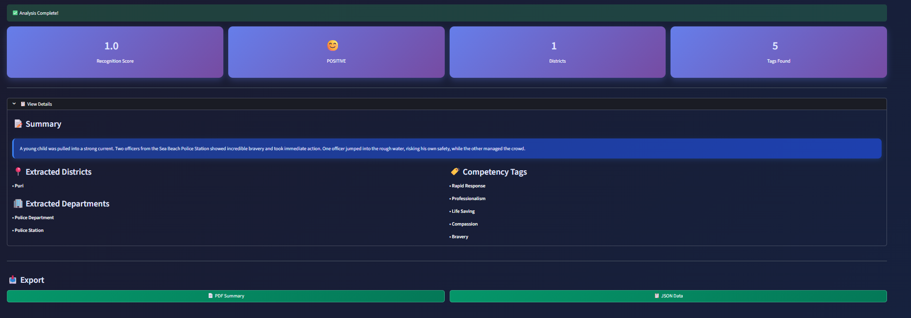
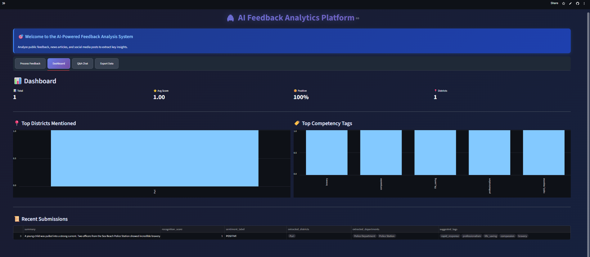
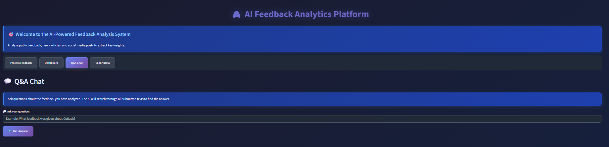

# 🚔 AI Feedback Analytics Platform

**Intelligent Text Analysis & Insights Generation System**

[](https://www.python.org/downloads/)
[](https://streamlit.io/)
[](https://huggingface.co/transformers/)

A Streamlit-powered web application that transforms unstructured feedback into actionable insights using state-of-the-art AI/ML models.

---

## 📋 Table of Contents
- Overview
- Features
- AI/ML Models
- Tech Stack
- Installation
- Usage
- Configuration
- Project Structure
- API Reference
- Screenshots

---

## 🎯 Overview
The **AI Feedback Analytics Platform** processes unstructured text from feedback, news, and social media. It uses machine learning models and extractors to provide insights like sentiment analysis, entity extraction, and competency tagging.

---

## ✨ Features
### 🤖 AI-Powered Analysis
- Sentiment classification
- Summarization
- Question-answering
- Language detection

### 📊 Custom Intelligence
- Entity extraction
- Competency tagging
- Recognition scoring

### 🎨 Dashboard
- Real-time analytics
- Bar charts
- Recent submissions table

### 💾 Export Options
- PDF
- CSV & JSON

---

## 🧠 AI/ML Models
Uses DistilBERT, BART, and RoBERTa for sentiment, summarization, and Q&A.

Recognition Score = min(1.0, Base_Score + Tag_Boost + Length_Boost)

---

## 🛠️ Tech Stack
- Streamlit
- Transformers
- PyTorch
- Langdetect
- Pandas
- ReportLab
- pdfplumber

---

## 📦 Installation
Clone repo, create venv, install dependencies, run Streamlit app.

```bash
git clone https://github.com/yourusername/ai-feedback-analytics.git
cd ai-feedback-analytics
python -m venv venv
venv/Scripts/activate
pip install -r requirements.txt
streamlit run app.py
```

---

## 🚀 Usage
Supports text input, file upload, dashboard insights, Q&A, and export.

---

## ⚙️ Configuration
Modify districts, departments, competency tags, and model parameters in `app.py`.

---

## 📁 Project Structure
```
ai-feedback-analytics/
├── app.py
├── requirements.txt
├── README.md
├── LICENSE
├── assets/
├── data/
├── tests/
└── docs/
```
## 📸 Screenshots
Below are placeholder entries for all PNG files located in your main project directory:


### Feedback Form


### Analysis Results


### Dashboard


### Export Data Page


### Q&A Chat


---

## 🔌 API Reference
Includes `load_models()`, `process_text()`, `extract_simple_entities()`, and `calculate_recognition_score()`.

---

## 📸 Screenshots
(Add your screenshot image paths here)

---

## 📞 Contact
Email: 22cs01075@iitbbs.ac.in

---

## ➕ Additional Files
### requirements.txt
```
streamlit>=1.28.0
transformers>=4.30.0
torch>=2.0.0
pandas>=2.0.0
langdetect>=1.0.9
reportlab>=4.0.0
pdfplumber>=0.10.0
```

### .gitignore
```
__pycache__/
*.py[cod]
venv/
.streamlit/
transformers_cache/


